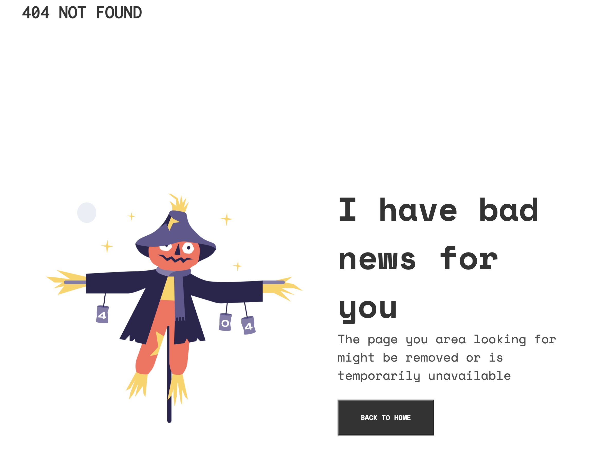

<!-- Please update value in the {}  -->

<h1 align="center">Page Not Found</h1>

   Solution for a challenge from  <a href="http://devchallenges.io" target="_blank">Devchallenges.io</a>.

  <h3>
    <a href="https://jmiguelqv.github.io/page-not-found/">
      Demo
    </a>
     | 
    <a href="https://github.com/jmiguelqv/page-not-found">
      Solution
    </a>
     | 
    <a href="https://devchallenges.io/challenges/wBunSb7FPrIepJZAg0sY">
      Challenge
    </a>
  </h3>

<!-- TABLE OF CONTENTS -->

## Table of Contents

-   [Overview](#overview)
    -   [Built With](#built-with)
-   [Features](#features)
-   [Contact](#contact)
-   [Acknowledgements](#acknowledgements)

<!-- OVERVIEW -->

## Overview

-   It was a little hard to apply flex and img size.
-   I learned about responsive design, how to do it technically from css file.

### Built With

<!-- This section should list any major frameworks that you built your project using. Here are a few examples.-->

-   HTML
-   CSS

## Features

<!-- List the features of your application or follow the template. Don't share the figma file here :) -->

This application/site was created as a submission to a [DevChallenges](https://devchallenges.io/challenges) challenge. The [challenge](https://devchallenges.io/challenges/wBunSb7FPrIepJZAg0sY) was to build an application to complete the given user stories.

## Acknowledgements

<!-- This section should list any articles or add-ons/plugins that helps you to complete the project. This is optional but it will help you in the future. For exmpale -->

-   [Steps to replicate a design with only HTML and CSS](https://devchallenges-blogs.web.app/how-to-replicate-design/)

## Contact

-   LinkedIn [jose miguel quesada varela](https://www.linkedin.com/in/jose-miguel-quesada-varela/)
-   GitHub [jmiguelqv](https://github.com/jmiguelqv/)
